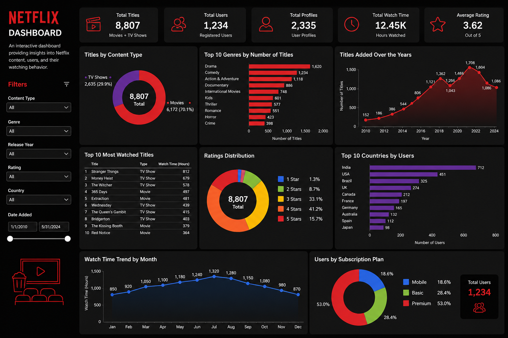

# 🍿 Netflix Data & User Engagement Analytics

An interactive Power BI dashboard powered by a relational PostgreSQL database to analyze Netflix content, subscriber demographics, and user viewing trends.



---

## 🛠️ Tech Stack & Architecture
- **Database:** PostgreSQL (pgAdmin 4)
- **Data Modeling & Visualization:** Power BI Desktop
- **Language:** DAX, SQL

---

## 💾 How to Recreate the Database

If you want to run this project locally:

1. Open **pgAdmin** or PostgreSQL CLI.
2. Create a new empty database named `netflix_db`.
3. Open the Query Tool and run the SQL script provided in this repo:
   ```sql
   -- Run the content of netflix_database.sql
